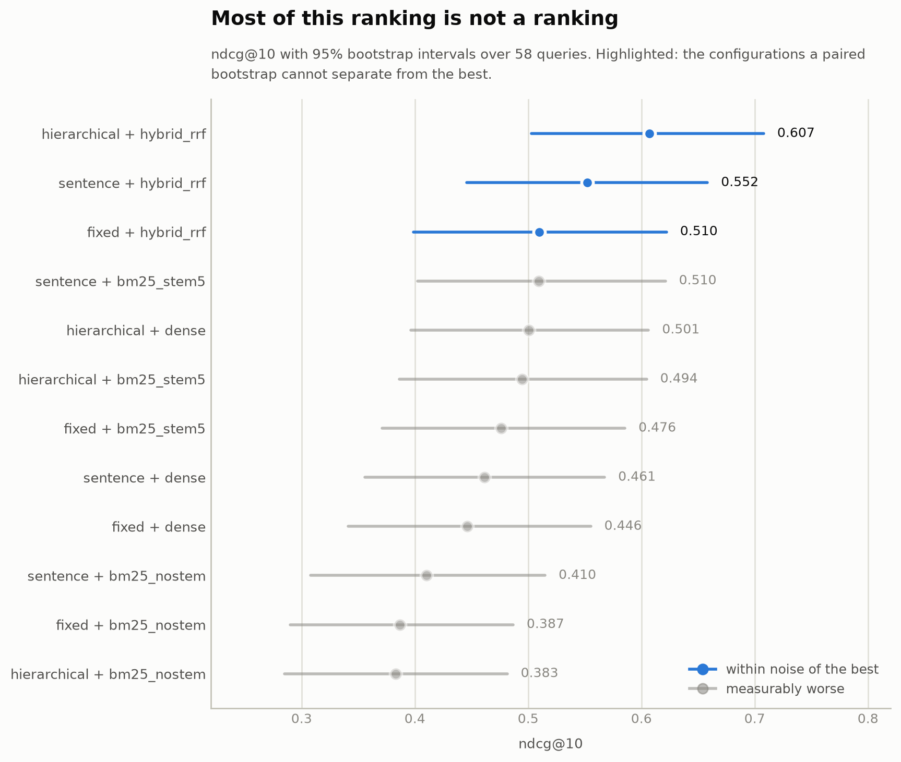
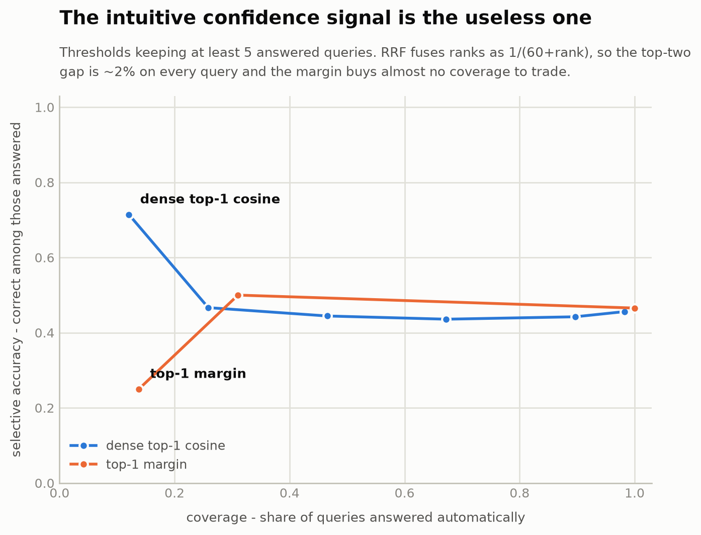

# turkish-rag-eval

[](https://github.com/RizgarOzan/turkish-rag-eval/actions/workflows/validate.yml)
[](NOTICE.md)
[](https://huggingface.co/datasets/RizgarOzan/turkish-rag-eval)

**Which parts of a RAG pipeline actually earn their cost on an agglutinative
language?** Three chunking strategies × four retrievers × six embedding
models, measured on a hand-labelled Turkish gold set, with confidence
intervals and a cost column — then pointed at your own documents.

```bash
pip install turkish-rag-eval
turkish-rag-eval run --corpus ./belgelerim --gold ./sorular.json
turkish-rag-eval report
```

## Three findings

**1. Turkish stemming is the cheapest real win.** Truncating tokens to a
5-character prefix before BM25 lifts nDCG@10 by 23–29% on every chunking
strategy, and a paired bootstrap puts every one of those gains clear of zero
(`hierarchical +0.111, 95% CI [+0.026, +0.204]`). "diyabet", "diyabetin",
"diyabete", "diyabetli" are four surface forms of one concept; an unstemmed
index almost never matches the query's form.

**2. Most of the ranking is not a ranking.** With 58 queries, only three of
twelve configurations are distinguishable from the best. The table below reads
as a leaderboard and mostly is not one.

<picture>
  <source media="(prefers-color-scheme: dark)" srcset="docs/charts/ndcg-intervals-dark.png">
  
</picture>

**3. The intuitive confidence signal is the useless one.** For deciding when
*not* to answer, the obvious measure — how far ahead the top hit is — is worse
than answering everything (0.25 selective accuracy against a 0.47 baseline).
RRF fuses ranks as `1/(60+rank)`, so the top-two gap is ~2% on every query,
confident or not. The dense retriever's raw cosine works; the margin does not.

<picture>
  <source media="(prefers-color-scheme: dark)" srcset="docs/charts/abstention-dark.png">
  
</picture>

Longer write-up of the first result:
[English](docs/blog/2026-09-19-bm25-turkish-en.md) ·
[Türkçe](docs/blog/2026-09-19-bm25-turkish-tr.md).

**Contents:** [Results](#results) · [Leaderboard](#leaderboard) ·
[Your own corpus](#your-own-corpus) · [Design decisions](#design-decisions) ·
[Abstention](#abstention) · [Groundedness](#groundedness) ·
[Reproducibility](#reproducibility) · [Running it](#running-it) ·
[Gold set](#gold-set) · [Limits](#limits) · [Contribute](#contribute)

## Results

58 queries, default embedding model
`paraphrase-multilingual-MiniLM-L12-v2`, CPU only. Intervals are 95% bootstrap
over queries; `turkish-rag-eval report` regenerates this table.

| Chunking | Retriever | nDCG@10 | 95% CI | R@5 | MRR | P95 |
|---|---|---|---|---|---|---|
| **hierarchical** | **hybrid_rrf** | **0.613** | [0.508, 0.716] | 0.690 | 0.559 | 37 ms |
| sentence | hybrid_rrf | 0.558 | [0.453, 0.662] | 0.621 | 0.500 | 27 ms |
| fixed | hybrid_rrf | 0.517 | [0.404, 0.629] | 0.578 | 0.484 | 31 ms |
| sentence | bm25_stem5 | 0.510 | [0.403, 0.621] | 0.638 | 0.462 | 4 ms |
| hierarchical | dense | 0.501 | [0.396, 0.606] | 0.569 | 0.441 | 30 ms |
| hierarchical | bm25_stem5 | 0.494 | [0.386, 0.605] | 0.569 | 0.444 | 8 ms |
| fixed | bm25_stem5 | 0.476 | [0.371, 0.585] | 0.526 | 0.421 | 4 ms |
| sentence | dense | 0.461 | [0.356, 0.567] | 0.552 | 0.410 | 21 ms |
| fixed | dense | 0.446 | [0.341, 0.555] | 0.491 | 0.402 | 25 ms |
| sentence | bm25_nostem | 0.411 | [0.308, 0.515] | 0.483 | 0.356 | 4 ms |
| fixed | bm25_nostem | 0.387 | [0.290, 0.487] | 0.414 | 0.319 | 3 ms |
| hierarchical | bm25_nostem | 0.383 | [0.285, 0.482] | 0.500 | 0.319 | 6 ms |

`turkish-rag-eval report` does not stop at the table — it names the cheapest
configuration the data cannot separate from the best:

```
Recommended: sentence + hybrid_rrf
  0.558 ndcg@10 against 0.613 for hierarchical + hybrid_rrf, a gap of 0.056
  that a paired bootstrap over 58 shared queries cannot distinguish from zero.
  It answers in 27 ms at P95 against 37 ms.
```

Comparisons are **paired**: both systems answered the same queries, so
resampling per-query differences removes the variance of some queries being
harder than others. It matters, and this data shows it in the sharpest way.
`hierarchical + hybrid_rrf` beats `fixed + hybrid_rrf` by 0.097 and beats
`sentence + bm25_stem5` by 0.104 — yet only the **larger** gap clears zero,
because its per-query differences are so much steadier (sd 0.34 against 0.40).
Ranking by the gap alone gets this backwards.

### What else the numbers say

**Hierarchical chunking only helps the dense retriever.** Prepending the
heading path to the embedded text moves dense nDCG@10 from 0.446 → 0.461 →
0.501 as chunking goes fixed → sentence → hierarchical. BM25 does not care.

**Fixed-size chunking lost on every retriever.** It is the most common default
and the worst performer in all four columns.

**Hybrid fusion only pays for a weak dense model.** RRF gives BM25's ranking
the same weight as the dense one. That lifts the small default (+0.106), but
pulls a strong model down: Mursit drops from 0.781 to 0.673, e5-base from
0.668 to 0.648. Whether to fuse should be measured, not assumed.

## Leaderboard

Measured 2026-09-18 on one 16-thread CPU (8 torch threads). Dense `nDCG@10`
per chunking strategy, the hybrid (dense + stemmed BM25, RRF) on hierarchical
chunks, and the cost: time to embed all three chunkings (5 643 chunks) and
per-query P95 on hierarchical chunks. Stemmed BM25 alone scores 0.476 / 0.510
/ 0.494. `turkish-rag-eval leaderboard` rebuilds this from `results/models/`.

| Model | Params | Turkish-only | Dense fixed | Dense sentence | Dense hierarchical | Hybrid hierarchical | Embed corpus | Query P95 |
|---|---|---|---|---|---|---|---|---|
| paraphrase-multilingual-MiniLM-L12-v2 (default) | 118 M | no | 0.446 | 0.461 | 0.501 | 0.607 | 2 min | 23 ms |
| [emrecan/bert-base-turkish-cased-mean-nli-stsb-tr](https://huggingface.co/emrecan/bert-base-turkish-cased-mean-nli-stsb-tr) | 111 M | yes | 0.408 | 0.431 | 0.497 | 0.654 | 4 min | 43 ms |
| [intfloat/multilingual-e5-small](https://huggingface.co/intfloat/multilingual-e5-small) | 118 M | no | 0.654 | 0.644 | 0.642 | 0.639 | 3 min | 22 ms |
| [intfloat/multilingual-e5-base](https://huggingface.co/intfloat/multilingual-e5-base) | 278 M | no | 0.631 | 0.677 | 0.668 | 0.648 | 10 min | 49 ms |
| [BAAI/bge-m3](https://huggingface.co/BAAI/bge-m3) | 568 M | no | 0.766 | 0.767 | — | — | > 45 min | — |
| **[newmindai/Mursit-Large-TR-Retrieval](https://huggingface.co/newmindai/Mursit-Large-TR-Retrieval)** | 404 M | yes | **0.746** | **0.740** | **0.781** | 0.673 | 35 min | 214 ms |

The two Turkish-only models are the most-downloaded Turkish entries in the
Hugging Face `sentence-similarity` category. `bge-m3` was stopped after 45
minutes, before the hierarchical chunks; its two numbers come from that
partial run. `google/embeddinggemma-300m` is gated behind a licence click and
was not run. Per-query results for every completed model are in
`results/models/`.

> These five rows were measured together on one machine before v0.1.0, which
> is why the timing columns are comparable with each other and not with the
> main table above. Their `dense` columns are unaffected by the stable
> tie-break, but each `Hybrid hierarchical` figure will move by roughly +0.006
> when the model is re-run — the default row's went 0.607 → 0.613.
> `turkish-rag-eval leaderboard --check` reports them as missing provenance
> until then.

**The model was the problem, not dense retrieval.** Every model trained for
retrieval (E5, bge-m3, Mursit) beats stemmed BM25 on its own, on every
chunking. A small E5 the same size as the default goes from 0.501 to 0.642
with no other change, as fast (22 ms) and 3 minutes to embed — the obvious
replacement for the default on a CPU.

**"Turkish-only" is not enough.** The `emrecan` model was trained for sentence
similarity (NLI + STS-b) and truncates input at 75 tokens, cutting 83–99% of
chunks short. A multilingual model a third of its training effort beats it.
Mursit, trained *for retrieval*, is the best here — at ~10× the query latency
of e5-small.

### Submitting a model

Open a pull request adding `results/models/<org>__<name>/`:

```bash
turkish-rag-eval run --model <org>/<name>
turkish-rag-eval leaderboard --check
```

CI does not take the numbers on trust. Every reported metric is re-derived
from the per-query relevance arrays committed beside it, and a new submission
must also carry the harness version and a corpus fingerprint matching the
pinned snapshot. Passing with a fabricated score would mean fabricating a
self-consistent set of per-query judgements across all twelve configurations.

## Your own corpus

The harness is not tied to its own articles. Point it at a folder of `.txt` or
`.md` files, a BEIR directory, or a JSON corpus:

```bash
turkish-rag-eval run --corpus ./belgelerim --gold ./sorular.json \
                     --retrievers bm25_stem5 bm25_nostem
```

A BM25-only run needs no model download and no torch — enough to answer "which
chunker, and is stemming worth it on my documents" from the base install.

**No labelled questions?** That is the real wall, and the reason most
benchmarks only ever measure themselves. `bootstrap` drafts a starting point:

```bash
export ANTHROPIC_API_KEY=...
turkish-rag-eval bootstrap ./belgelerim --out gold-draft.json --per-doc 3
```

It runs the same procedure the contributed questions in this repository used.
One pass writes questions and marks the answer span; a second pass sees only
the document and the questions and marks the span again. Where the passes
disagree the item is written as `"review": "needs-human"` and **never loads**
until a person settles it. Spans that are not verbatim, and questions copied
out of their own answer, are dropped with a reason.

What you get is a draft to review, not a gold set. The honest pitch is half an
hour of arbitrating disagreements instead of a week of writing questions.

## Design decisions

The parts worth arguing about, rather than the parts that were obvious.

**Relevance is defined at the answer span, not the chunk.** Each gold item
names the source document and a short verbatim span from it; a retrieved chunk
counts as relevant when it comes from that document *and* contains the span.
Chunk-level labels would have to be redone for every chunking strategy, which
would make the comparison between strategies meaningless — the thing the
harness exists to measure.

**Questions are paraphrased, never copied.** "Şeker hastalığı teşhisi konan
kişilerin ne kadarında ketoasidoz da bulunuyor?" is asked of text reading
"yaklaşık %25'i, diyabet teşhisi konulduğunda...". A lexically copied question
hands BM25 an unearned win and silently inflates every sparse row in the
table. CI rejects any contributed question with more than 60% word overlap
with its own answer span.

**The relevance gate folds case with `str.lower()`, not `turkish_lower()`.**
That looks like exactly the bug this project studies, and is not.
`turkish_lower` matters when a *query* is matched against a *document*: the
two are written independently, so surface form and casing diverge. The
relevance gate instead matches a verbatim span against the very text it was
copied from, so both operands are the same run of characters, and `lower()` is
context-free per character. Using a different fold here would desynchronise
the evaluator from `validate_gold.py`, which admits gold under the same
normaliser.

**RRF instead of score interpolation.** Cosine similarity and BM25 scores live
on different, corpus-dependent scales; fusing ranks needs no per-corpus
tuning. `k=60`, from Cormack et al. (2009).

**Two annotation passes agree by containment, not by similarity.** 89 of the
90 double-labelled questions here are containment pairs — one span inside the
other — yet 35 fall below a 0.6 Jaccard floor, 34 of them containment pairs.
The passes were almost never disagreeing about *where* the answer is, only
about how much of the sentence to sweep in, and containment is what the
harness itself tests. A similarity floor alone would have sent a reviewer to
arbitrate a third of an already-reviewed set. The one genuine disagreement —
two different sentences that both name polysomes — is the one the rule holds
back, and `passes_agree()` reproduces all 90 of the committed labels exactly.

**Ties break stably.** `np.argsort` defaults to an unstable sort, and sparse
scores tie constantly — every chunk sharing no query term scores exactly 0.0.
An unstable tie at rank 1 moves Recall@1 and MRR between runs on identical
data.

## Abstention

`turkish-rag-eval abstain` treats "should this be answered automatically?" as
a measurement rather than a guess: it sweeps a confidence threshold and
reports the coverage / selective-accuracy trade-off, so an operator can pick
the point that meets an accuracy floor and escalate the rest.

Unfiltered top-1 accuracy is 0.466. Using the dense retriever's raw cosine:

| threshold | coverage | selective accuracy | answered | escalated |
|---|---|---|---|---|
| 0.65 | 0.672 | 0.436 | 39 | 19 |
| 0.70 | 0.466 | 0.444 | 27 | 31 |
| 0.75 | 0.259 | 0.467 | 15 | 43 |
| **0.80** | **0.121** | **0.714** | 7 | 51 |

At a 70% accuracy floor the harness picks threshold 0.80: 12% of queries
answered automatically, 51 sent to a human. At an 80% or 90% floor it reports
that **no threshold qualifies** — a real answer, not a failure. It means this
configuration should not run unattended at that requirement.

The top-1 margin, plotted above, is the signal most people reach for first and
is actively misleading on fused rankings.

## Groundedness

Retrieval is half of RAG, so the generation half is scored too — using a label
the gold set already carries, the verbatim answer span, rather than a second
round of annotation:

```bash
turkish-rag-eval groundedness --limit 20
```

The split is the point. The harness already knows whether the answer span was
retrieved, which divides every query into two populations that deserve
different questions:

- **Span retrieved** — the answer should rest on the passages and convey the
  span. Both go to a judge.
- **Span not retrieved** — nothing in the context answers the question, so the
  only correct behaviour is to decline. Answering anyway is a hallucination,
  and *that* rate is what decides whether a Turkish RAG system can face users.

A single pooled "accuracy" hides exactly that number. Abstention is detected
deterministically through a sentinel the generator is instructed to emit, so
"did it decline" never depends on a judge's mood; only groundedness and
correctness cost a model call.

## Reproducibility

A benchmark whose numbers cannot be reproduced is not comparable, so:

- **The corpus is pinned.** `data/corpus.lock.json` records a fingerprint over
  every article's text plus its Wikipedia revision id.
  `turkish-rag-eval fetch-corpus --verify` fails and names the articles that
  moved. Wikipedia still changes; the point is that it can no longer change
  silently.
- **Every result records its provenance** — harness version, corpus
  fingerprint, document count — in each summary row.
- **Ranking is deterministic**, ties included.
- **Dependencies are pinned**, and results are quoted against a release tag.

The main table above was re-run on v0.1.0 and carries the pinned corpus
fingerprint. The re-run is also the clearest evidence the tie-break mattered:
**eight of the twelve rows came back bit-identical**, and the four that moved
are exactly the ones where ties are expected — the three `hybrid_rrf` rows,
whose RRF scores collide at `1/(60+rank)`, and one `bm25_nostem` row, where
every chunk sharing no query term scores exactly 0.0. No `dense` or
`bm25_stem5` row changed by a single digit.

## Running it

Python 3.10+. CPU only — no GPU anywhere in this project.

```bash
pip install turkish-rag-eval            # metrics, BM25, gold-set tooling
pip install 'turkish-rag-eval[all]'     # + dense retrieval, charts, LLM commands
```

| Command | What it does |
|---|---|
| `run` | every chunking × retriever combination; writes `results/` |
| `report` | intervals, paired comparisons, and a recommendation |
| `charts` | the two figures above, light and dark |
| `leaderboard` | rebuild the model table; `--check` verifies every entry |
| `abstain` | coverage / selective-accuracy curve for the best configuration |
| `groundedness` | score the generation half against the gold spans |
| `bootstrap` | draft a gold set for your own corpus |
| `agreement` | inter-annotator agreement over the gold set |
| `fetch-corpus` | download the Wikipedia snapshot; `--verify` checks the lock |
| `export-hf` | the BEIR layout MTEB reads |
| `validate` | every gold file's invariants |

From a checkout:

```bash
git clone https://github.com/RizgarOzan/turkish-rag-eval
cd turkish-rag-eval
pip install -e '.[all]'
turkish-rag-eval fetch-corpus     # rebuilds data/raw/corpus.json
turkish-rag-eval run              # results/summary.json + per-query files
python -m pytest -q
```

`run --model <name>` swaps the embedding model; any sentence-transformers
model works. Results for a non-default model go to
`results/models/<org>__<name>/`, so the main table is never overwritten.

## Gold set

| Files | Questions | Labelled by | In the results above |
|---|---|---|---|
| `data/eval/gold.json` (health) | 58 | one human | yes |
| `data/eval/contrib/llm-draft-*.json` (history, geography, astronomy, biology, computing) | 90 | two independent LLM passes | not yet |

The set is growing toward 300 questions across more domains. Questions a model
drafted are marked `"source": "llm-draft"`. A second model then picked its own
answer span for each one without seeing the first label
(`second_annotation`). Two spans agree when one contains the other or their
token F1 is at least 0.5; agreed items get `"review": "agreed"`, the rest get
`"needs-human"` and are never loaded. Batches 1 and 2 were 30 of 30 agreed,
batch 3 was 29 of 30: for "what are several ribosomes working on one mRNA
called?" the passes picked two different sentences that both name polysomes,
so that question waits for a person.

Drafts stay out of every number above until a re-run says otherwise:
`load_gold()` skips them unless called with `include_drafts=True`. Synthetic
test questions are common practice as long as they are declared and their
agreement is measured. This section is that declaration.

The corpus is 54 Turkish Wikipedia articles, 1.09 M characters; 27 of them
answer at least one question and the other 27 are distractors from the same
domain.

### Agreement between the two passes

| Batch | Questions | Identical | Mean IoU | Mean token F1 | Cohen's κ, fixed / sentence / hierarchical |
|---|---|---|---|---|---|
| 1 — 2026-09-18 (Malazgirt, Kapadokya, Mars, Mitokondri, Linux) | 30 | 16 | 0.816 | 0.878 | 1.00 / 1.00 / 1.00 |
| 2 — 2026-09-20 (İstanbul'un Fethi, Ağrı Dağı, Jüpiter, Fotosentez, İnternet) | 30 | 4 | 0.419 | 0.540 | 0.96 / 1.00 / 1.00 |
| 3 — 2026-09-21 (Çaldıran Muharebesi, Tuz Gölü, Satürn, Ribozom, Unix) | 30 | 18 | 0.829 | 0.872 | 0.92 / 0.96 / 0.96 |
| **All drafts** | 90 | 38 | 0.688 | 0.763 | 0.96 / 0.99 / 0.99 |

"Identical" means identical after tokenisation, so case and punctuation are
folded; by raw string the counts are 1, 2 and 18. IoU and token F1 come from
`agreement.py`; κ is that file's chunk-level measure — for each chunking
strategy, the binary "does this chunk contain the answer" label each span
assigns to each chunk of its article, which is exactly how `run_eval.py`
decides what counts as a hit.

The two rows disagree about wording, not about the answer, and that gap is
what set the containment rule in [Design decisions](#design-decisions). In
batch 2 the second pass kept picking the shortest span that still answers the
question ("7.4 büyüklüğünde" against the whole clause around it), which halves
IoU — yet the labels the benchmark actually scores are the same: of the 180
question × strategy runs, 3 differ, all with fixed-size chunks, where the
shorter span also fell inside one neighbouring overlapping window. Batch 3
has 5 differing runs of 90: three are the needs-human question above, two are
the same short-span effect with fixed chunks. Two LLMs
tend to pick the same sentence, so read this as a sanity check rather than as
human agreement.

The κ column is measured locally, because it needs the fifteen draft articles
in the corpus and `data/raw/` is fetched rather than committed; the other
columns are recomputed from the files in CI (`tests/test_readme_agreement.py`).
Wiring the embedded second labels into `agreement.py` itself is
[#15](https://github.com/RizgarOzan/turkish-rag-eval/issues/15).

## Why not an existing benchmark?

MTEB-style retrieval benchmarks score an embedding model on passages that are
already split. They answer "which model?", not "which chunker, is Turkish
stemming worth it, does a hybrid help, and what does each cost on a CPU?".
This harness keeps articles whole, lets every chunker cut them its own way,
and judges each chunk by the answer span, so pipeline choices can be compared
on the same labels. For a model-only comparison, the same data exports to the
BEIR layout MTEB reads (`turkish-rag-eval export-hf`), published as
[RizgarOzan/turkish-rag-eval](https://huggingface.co/datasets/RizgarOzan/turkish-rag-eval).

## Limits

- **58 queries is a small set.** The intervals above are the honest width of
  that; most of the table's ordering is not resolved by this much data. They
  replace the eyeballed rule of thumb this project used to carry — "treat
  differences under roughly 0.05 nDCG as noise" — which was both too strict
  for paired comparisons and too loose for unpaired ones.
- **One annotator for the human set.** The 58 health questions are
  single-annotated, so they have no agreement figure. The 90 drafted questions
  are double-labelled, but by two LLM passes rather than by two people.
- **The corpus is Wikipedia, and so is much of the training data.** Every
  embedding model ranked here was almost certainly trained on Turkish
  Wikipedia. Absolute scores are therefore optimistic; the *comparison*
  between pipeline choices on the same corpus is what this measures. A
  non-Wikipedia domain is the most valuable thing a contributor could add.
- **Six embedding models, one corpus.** `bge-m3` is a partial run and
  EmbeddingGemma is missing. `abstain` uses only the default model.
- **Encyclopaedic text, not clinical text.** Nothing here transfers to a
  clinical setting without re-measurement. No patient data is used anywhere,
  and nothing here is a medical device.
- **Groundedness is judged by a model**, on a 58-question set, and its
  absolute numbers should be read as a direction rather than a rate.
- **The embedding model is pinned by name, not by revision.**

## Contribute

The first two limits shrink with every contributor. Adding questions needs no
ML background — pick a Turkish Wikipedia article, write 5–10 paraphrased
questions, and open a pull request with one JSON file. A validator checks each
file against Wikipedia in CI. See [CONTRIBUTING.md](CONTRIBUTING.md) (Türkçe
açıklama dahil) and the
[open issues](https://github.com/RizgarOzan/turkish-rag-eval/issues).

Submitting an embedding model is one command and a pull request — see
[Leaderboard](#leaderboard).

## Notes on Turkish

Two language-specific traps are handled in `turkish_text.py`:

- `"İLTİHAP".lower()` returns `i̇ltihap` in Python — an `i` plus a combining
  dot (U+0307) — and `"ISIRIK".lower()` returns `isirik` instead of `ısırık`.
  Turkish needs `I→ı` and `İ→i` applied before the generic lowercase.
- Fixed-prefix stemming at 5 characters is used instead of a morphological
  analyser. It is crude and will conflate unrelated words sharing a prefix;
  the table above is the argument that it still pays for itself. This is a
  known-strong Turkish IR baseline, not a new idea — what is measured here is
  what it is worth inside a modern chunked RAG pipeline.

## Data

Turkish Wikipedia, CC BY-SA 4.0. See [NOTICE.md](NOTICE.md).

## Licence

Code MIT ([LICENSE](LICENSE)); data under `data/` CC BY-SA 4.0
([NOTICE.md](NOTICE.md)).
